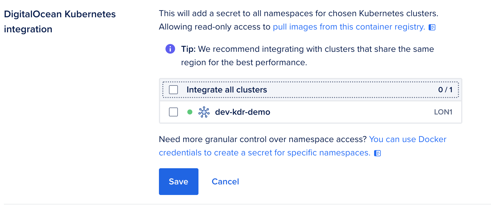

## Using the infrastructure

Now that the infrastucture is created you will be able to check this on
the [DigitalOcean Website](https://www.digitalocean.com).

On the dashboard, find Kubernetes on the left hand side menu. You will find the Kubernetes Cluster that you have just
built:

and, if you find the Container Registry menu option, you will find the second item that we built. This is a private
Container Registry that we will use to hold your containers that will be deployed to this infrastructure.

Click the second Edit (the one for DigitalOcean Kubernetes Integration)

Tick the tick box and click `Save`

**It is very important that you do this, for the rest of the process to work**

You can now return to the script and answer the prompt with a `y`.