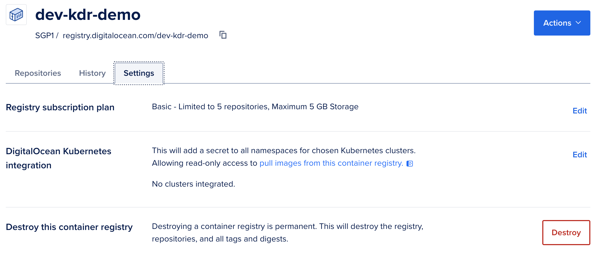

# Infrastructure

To be able to create a kubernetes cluster, you are required to clone your forked project, and configure some access
tokens.
----
## Prepare the infrastructure

To create the required infrastructure on DigitalOcean, we are first going to clone your forked version of this
infrastructure.

This is so that you can execute the commands required to run the build scripts. The build scripts will also, check the
state of your cluster back in to the GitHub repository, therefore keeping track and control of the state of your
cluster.

You need to open a terminal on your computer and run the following commands, it is important though that you clone your
repository and not mine.

    cd ~
    mkdir github.com
    cd github.com
    git clone https://github.com/mariadb-kester/terraformDemo.git

**Make sure you change the `mariadb-kester` part with your own GitHub username.**

The system will clone the repository to your computer:

    Cloning into 'terraformDemo'...
    remote: Enumerating objects: 55, done.
    remote: Counting objects: 100% (55/55), done.
    remote: Compressing objects: 100% (52/52), done.
    remote: Total 55 (delta 0), reused 55 (delta 0), pack-reused 0
    Receiving objects: 100% (55/55), 486.76 KiB | 236.00 KiB/s, done.

Now, change in to the cloned directory:

    cd terraformDemo

To be able to continue you require a [DigitalOcean API Key](./apikey.md). Once you have your key you need to use this to
create a local environment variable. Replace the below (after the = and up to the ") with your own API key.

    echo "export TF_VAR_demo_digital_ocean_token=dop_v1_xxxxxxxxxx" > .env

----

## Build the infrastructure

From the `~/github.com/terraformDemo` directory, that you should already be in on your terminal, it is very simple to
build the infrastructure in DigitalOcean.

There is a `make` script provided. These make it very easy for commands to be executed.

The make script provide 4 options.

- [init](#init)
- [plan](#plan)
- [apply](#apply)
- [destroy](#destroy)

### init

The init command initialises your system ready for deployment.

`make init-dev`

When you run this command, you would expect output similar to the following:

### plan

The plan command, creates a plan of what it would do and ensures everything is ready.

`make plan-dev`

After running this command, the system will return to you what it is planning to do, your output should look similar to
this, without any errors.

### apply

The apply command, actually creates the infrastructure. This takes 5 to 6 minutes to complete.

`make apply-dev`

Your output should look similar to this. Hopefully you will see `Apply complete!`, and this means your infrastructure is
ready.

### destroy

The destroy command will delete the infrastructure. This is important, if you have finished using it, to stop getting
charged. Clearly, do not run this until you have finished.

`make destroy-dev`

If you are running the destroy command, it will ask you to confirm by typing `yes` at the prompt.

----

## Using the infrastructure

Now that the infrastucture is created you will be able to check this on
the [DigitalOcean Website](https://www.digitalocean.com).

On the dashboard, find Kubernetes on the left hand side menu. You will find the Kubernetes Cluster that you have just
built:

and, if you find the Container Registry menu option, you will find the second item that we built. This is a private
Container Registry that we will use to hold your containers that will be deployed to this infrastructure.

Unfortunately, we are unable to automate the integration via Terraform, and we therefore must tick the 'Integrate all
clusters' option and the `Save and Continue` button.

**It is very important that you do this, for the rest of the process to work**