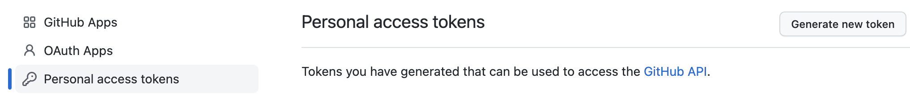
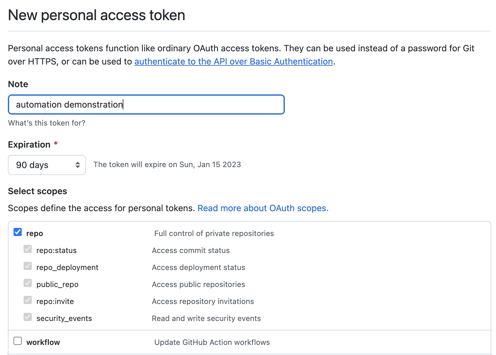

# GitHub

A personal access token is used to identify you, and control the access you have to your repositories. _

### GitHub Personal Access Token

To do this browse to your GitHub and click your username in the top right corner and select settings. Scroll down to the
bottom of the left hand side menu and select `Developer settings`. Select Personal access tokens and
the `Generate new token` option.

Complete the details, and select the `repo` option.

and select the `Generate token` button at the bottom of the page. Copy the provided token, and store this safe, as you
will not be able to view it again. 